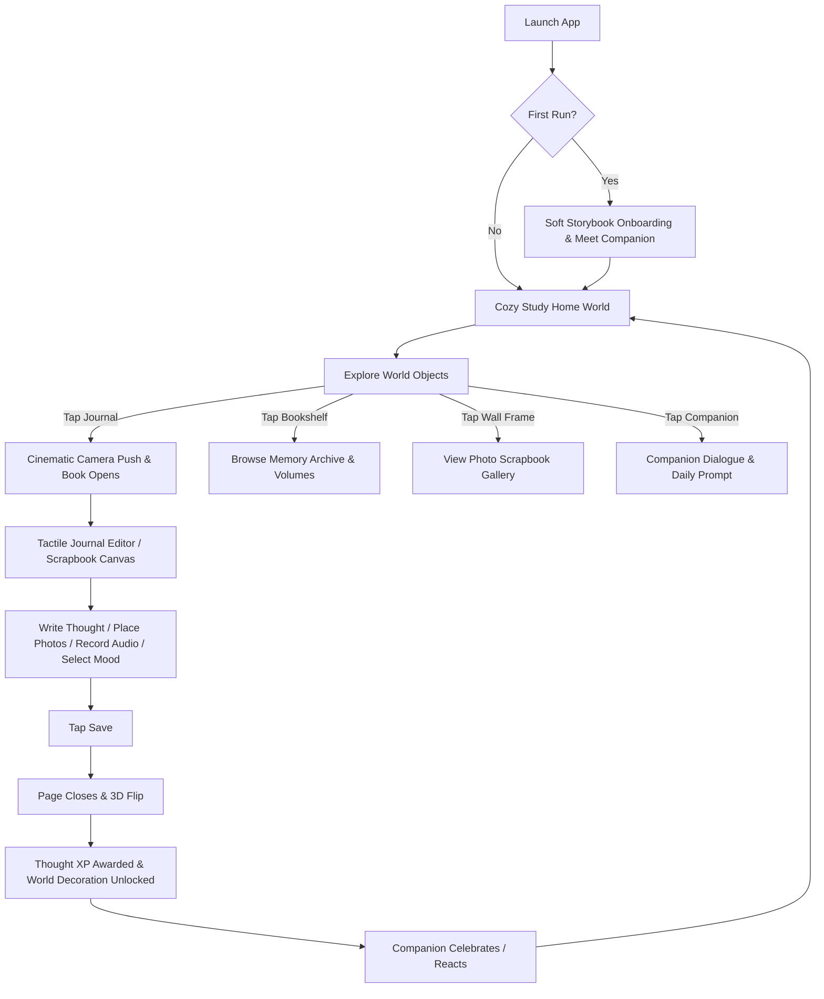
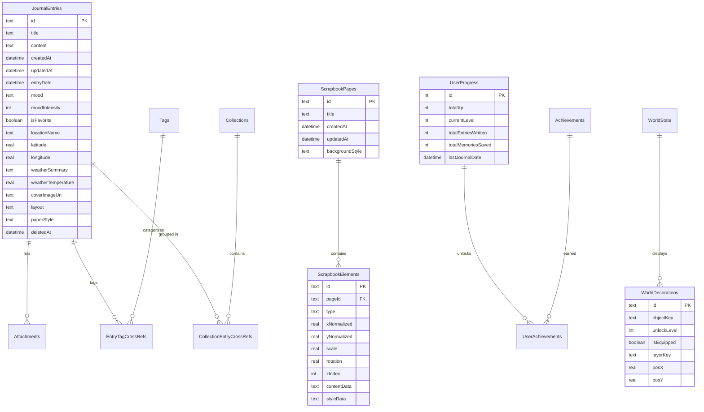

# Living Journal (Chronicle) — Product & Technical Architecture

> **Document Version:** 1.0.0  
> **Target Platform:** Android (Flutter + Dart)  
> **Status:** Architecture Blueprint  
> **Core Concept:** Journaling + Tactile Scrapbook + Interactive Illustrated World + Light RPG Progression + Companion Visual Novel Interactions

---

## 1. Product Vision

**Living Journal** is not a conventional utilitarian productivity tool or a generic Material Design dashboard. It is an **interactive personal sanctuary**—a cozy, living, illustrated world where every thought, photo, voice reflection, and scrapbook entry gradually takes physical form in the user's environment.

### Core Philosophy
* **"The World is Your Mirror"**: As you reflect and write, your cozy personal study comes to life. Shelves fill with bound volumes of your past memories, wall frames showcase cherished moments, indoor botanicals bloom, and ambient lighting shifts with real time and weather.
* **Calm, Non-Manipulative Presence**: No toxic guilt-based streak counters, no aggressive push notifications, and no shame mechanics for missing days. If a user returns after months, their companion character warmly greets them: *"It's so good to see you again. Take all the time you need."*
* **Tactile Physicality**: Retaining the deep physical aesthetic of textured paper, washi tape, deckled borders, postal stamps, polaroids, and realistic 3D page-flip reading physics.
* **Privacy & Local-First Sovereignty**: 100% functional without internet connectivity. All journal entries, scrapbook canvases, and progression metrics stay on the user's device in local SQLite storage.

---

## 2. Feature Map

```
LIVING JOURNAL ECOSYSTEM
├── 1. HOME WORLD (Cozy Study Environment)
│   ├── Layered 2D Parallax Scene (Depth Layers 0–7)
│   ├── Interactive World Objects (Journal, Bookshelf, Gallery Wall, Plant, Lamp, Window)
│   ├── Atmospheric FX (Dust motes, lamplight glow, window weather/time sync)
│   └── Room Evolution System (Progressive decor unlocks based on journaling milestones)
│
├── 2. COMPANION CHARACTER SYSTEM
│   ├── Original Companion: "Fable" (an inquisitive, gentle spirit of written memory)
│   ├── State Machine: Idle, Reading, Writing, Curious, Celebrating, Resting, Greeting
│   ├── Visual-Novel Dialogue & Mood Reflections
│   └── Welcoming Return System (Gentle restorative dialogue)
│
├── 3. JOURNALING & WRITING ENGINE
│   ├── Tactile Paper Editor (Ruled, Plain, Grid, Vintage Parchment)
│   ├── Rich Media Attachments (Photos, Voice Notes, Mood Intensity, Tags, Location, Weather)
│   ├── Draft Persistence & Auto-Save Recovery
│   └── 3D Physical Book Reader (Dual-spread, perspective page curl, wood desk backdrop)
│
├── 4. FREEFORM SCRAPBOOK STUDIO
│   ├── Multi-Touch Spatial Canvas (Pan, Pinch-to-Zoom, Bounds Management)
│   ├── Manipulable Items (Polaroids, Text Snippets, Washi Tape, Stickers, Doodles)
│   ├── Gesture Transformations (Drag translation, rotation, pinch scale, z-index layering)
│   └── Local Serialization (Drift SQLite JSON/Relational canvas state)
│
├── 5. MEMORY ARCHIVE & LIVING VISUALIZATIONS
│   ├── Interactive Bookshelf (Past entries grouped into bound volumes)
│   ├── Gallery Wall (Photo memories framed on study walls)
│   ├── "On This Day" Time Capsule Reflections
│   └── Multi-criteria Search & Tag Filtering
│
├── 6. GENTLE PROGRESSION & RPG MILESTONES
│   ├── Thought XP & Sanctuary Levels (Gained through writing, photos, and scrapbook creations)
│   ├── Physicalized Collectibles (Desk figurines, vintage inks, unique stamps)
│   └── Sanctuary Upgrades (More books, blooming vines, brass telescope, cozy rug)
│
└── 7. SYSTEM & PRIVACY VAULT
    ├── Biometric & PIN Security Gate
    ├── Local Backup & Encryption (ZIP/JSON archive)
    ├── PDF Journal Book Export
    └── Offline-First Open-Meteo & Nominatim Ambient Services
```

---

## 3. User Journey



---

## 4. Screen Map & Navigation Hierarchy

Using declarative routing via `go_router`:

```
/ (NavigationShell or World View)
├── /world (Primary Home World - Interactive 2D Study)
│   ├── [Tap Journal] ──> /editor?id=:id (Cinematic Push Transition)
│   ├── [Tap Bookshelf] ──> /memories (Bookshelf Memory View)
│   ├── [Tap Wall Gallery] ──> /scrapbook/:id (Scrapbook View)
│   └── [Tap Companion] ──> Overlay: Companion Dialog Modal
│
├── /book-reader (3D Physical Book Reading Mode)
│   └── /book-reader/:id
│
├── /journal (Classic Chronological Timeline)
├── /calendar (Monthly Calendar Grid with Mood Stamps)
├── /scrapbook-editor (Freeform Canvas Studio)
│   └── /scrapbook-editor/:id
│
├── /insights (Writing Metrics & Sanctuary Growth)
├── /achievements (Sanctuary Collectibles & Badges)
├── /settings (Theme, Reduced Motion, Passcode, Backups)
├── /lock (Biometric & PIN Verification Screen)
└── /onboarding (Initial Storybook Introduction)
```

---

## 5. Illustrated World System Architecture

The world is constructed as an optimized, multi-layer 2D viewport with subtle parallax and atmospheric particle systems:

```
┌──────────────────────────────────────────────────────────┐
│ LAYER 7: Atmosphere & Particles (Dust motes, lamp light) │
├──────────────────────────────────────────────────────────┤
│ LAYER 6: Foreground Props (Desk rim, steaming mug)       │
├──────────────────────────────────────────────────────────┤
│ LAYER 5: Character (Companion "Fable" - animated states) │
├──────────────────────────────────────────────────────────┤
│ LAYER 4: Interactive World Objects (Journal, Bookshelf)  │
├──────────────────────────────────────────────────────────┤
│ LAYER 3: Furniture & Room Fixtures (Writing desk, chair) │
├──────────────────────────────────────────────────────────┤
│ LAYER 2: Room Architecture (Floorboards, walls, rug)     │
├──────────────────────────────────────────────────────────┤
│ LAYER 1: Window Vista (Distant clouds, day/night cycle)  │
├──────────────────────────────────────────────────────────┤
│ LAYER 0: Skybox & Ambient Background Gradient            │
└──────────────────────────────────────────────────────────┘
```

### Depth & Parallax Engine
* **Parallax Factor**: Layer offsets calculated as `offset = panDelta * layerDepthCoefficient` (Depth ranges from `0.02` for Layer 0 to `0.35` for Layer 6).
* **Gyroscope / Pointer Sensitivity**: Subtle ambient tilt on physical device motion (damped with `Curves.easeOutQuad`).
* **Repaint Boundaries**: Every layer is wrapped in an independent `RepaintBoundary` so animating dust motes on Layer 7 does NOT invalidate the static furniture on Layers 2 and 3.

---

## 6. Journal System Architecture

* **Offline-First Storage**: Powered by Drift SQLite (`JournalEntries`, `Tags`, `Attachments`).
* **Relational Schema**: Entries maintain references to attachments (photos, voice notes), join tables for multi-tag associations, and layout preference flags.
* **Auto-Save & Crash Proofing**: Debounced draft writes to `SharedPreferences` ensure in-progress reflections are never lost if battery dies or OS suspends the app.
* **Rich Metadata Support**: Geo-coordinates, locality display names, Open-Meteo ambient weather summaries, mood categorization with 1–5 intensity levels.

---

## 7. Memory System Architecture

* **Living Relics**: A memory is not just a database row; it is an artifact inside the study.
* **Anniversary Retrieval ("On This Day")**: Drift queries match `strftime('%m-%d', entryDate)` to automatically trigger memory cards and nostalgic companion dialogue.
* **Interactive Bookshelf**: Groups past years and months into vintage leather-bound book spines on the study's bookshelf. Tapping a volume opens the 3D Book Reader directly into that month's reflections.

---

## 8. Scrapbook System Architecture

* **Spatial Freeform Canvas**: Allows users to place media freely in 2D space `(x, y, scale, rotation, zIndex)`.
* **Gesture Controller**:
  - `Matrix4` transformations supporting multi-finger translation, pinch-to-scale, and dual-finger twist rotation.
  - Haptic snaps at 0°, 90°, 180°, and 270° angles for crisp alignments.
* **Canvas Element Types**:
  - `PhotoCard`: Polaroid with customizable washi tape styles.
  - `NoteCard`: Torn lined or grid paper with handwritten fonts.
  - `Sticker`: Vintage postage stamps, floral illustrations, wax seals.
  - `Doodle`: Vector path drawings captured via finger stylus input.
* **Persistence Schema**: Drift table `ScrapbookPages` with child records `ScrapbookElements` storing normalized relative coordinates `(0.0 to 1.0)` for cross-screen density independence.

---

## 9. Character System Architecture

### Companion Character: **"Fable"**
* **Identity**: An artisanal, original companion inspired by classic storybook aesthetics—wearing a warm oversized knitted scarf, round spectacles, and carrying a small brass quill pen.
* **Animation Architecture**: Layered 2D component structure (Head, Hair, Eyes, Scarf, Body, Quill).
* **State Machine**:
  - `IDLE`: Subtle breathing cycle, soft blinking.
  - `READING`: Head bowed, spectacles lowered, flipping a miniature ledger.
  - `WRITING`: Scribbling notes with the brass quill, ink sparkles.
  - `HAPPY`: Warm smile, gentle nod of affirmation.
  - `CURIOUS`: Head tilt, eyes widened with soft interest.
  - `CELEBRATING`: Soft leap with floating golden leaf particles.
  - `GREETING`: Stepping forward, welcoming hand wave.
* **Non-Guilt Retention Logic**:
  - `daysSinceLastJournal == 0`: *"You're making today memorable!"*
  - `daysSinceLastJournal == 1`: *"The study was peaceful today. What's on your mind?"*
  - `daysSinceLastJournal >= 5`: *"Welcome back! The study has been waiting warmly for you. Take your time."*

---

## 10. Gamification & Progression Architecture

### Thought XP System
* Writing a journal reflection: **+25 XP**
* Adding a photo memory: **+10 XP**
* Creating a scrapbook page: **+30 XP**
* Recording a voice reflection: **+15 XP**

### Sanctuary Growth Tiers
1. **Level 1 (The Novice Study)**: Basic desk, single journal, simple kerosene lamp.
2. **Level 3 (The Cozy Nook)**: First photo frame appears on the wall, brass clock on the shelf.
3. **Level 5 (The Flourishing Study)**: Potted ivy plant appears by the window, bookshelf gains leather volumes.
4. **Level 10 (The Scholar's Haven)**: Window opens to starry night sky, cozy wool armchair beside the fireplace.
5. **Level 20 (The Celestial Archive)**: Brass brass telescope unlocked, stained-glass window illumination.

### Collectibles & Achievements
* Styled as physical wooden or enamel tokens inside a glass display case on the desk.
* Examples: *"First Memory Written"*, *"A Forest of Words"*, *"The Sound of Autumn"*, *"Keeper of Secrets"*.

---

## 11. Animation Architecture

| Animation Type | Engine / Mechanism | Target Locations |
| :--- | :--- | :--- |
| **Scene Parallax** | `Transform.translate` + Gyroscope/Drag Streams | Layered Study Background |
| **Camera Focus** | `AnimatedBuilder` with 2D Matrix Scaling & Translation | World to Journal/Bookshelf transitions |
| **Book Page Turn** | 3D `Matrix4.rotationY` + Gradient Shadow Shaders | Book Reader & Journal opening |
| **Character State** | Procedural Multi-layer Flutter Rig / Sprite Sheet | Companion Fable |
| **Atmospheric FX** | Lightweight `CustomPainter` with ticking time delta | Floating dust motes, candle flame flicker |
| **Scrapbook Gestures** | Matrix-based Interactive Canvas | Scrapbook Studio |

---

## 12. Complete Database Schema (Drift + SQLite)



---

## 13. Asset & Performance Architecture

* **Modular Vector/Canvas Assets**: High-touch background and prop components rendered via high-performance `CustomPainter` path caching where feasible to maintain low APK size and ultra-fast load times.
* **Raster Illustration Sprites**: PNG/WebP files organized into resolution buckets (`assets/worlds/cozy_study/`, `assets/character/fable/`).
* **Font Asset Optimization**: Serif and handwritten typography tree-shaken with only required glyph sets.
* **Target Frame Budget**: 60 FPS on Android API 26+ devices. All particle systems bound by `< 30` active particles per frame with zero object allocation during paint ticks.

---

## 14. State-Management Architecture

* **Engine**: `flutter_riverpod` (v3+ Notifier Architecture).
* **Domain Decoupling**: Pure domain models (`JournalEntryWithDetails`, `ScrapbookCanvasState`, `WorldState`, `CompanionMood`) completely separated from Flutter UI widgets.
* **Reactive Streams**: Database operations expose reactive Drift `watch()` streams converted into Riverpod `StreamProvider` instances for immediate, lag-free UI updates upon database mutation.

---

## 15. CI/CD Architecture

* **Pipelines**: Dual GitHub Actions workflows:
  1. `ci.yml`: Formatting check, static analysis (`flutter analyze`), unit/widget testing (`flutter test`), and debug APK build verification on every pull request and push to `main`.
  2. `android-release.yml`: Triggered on tag pushes (`v*.*.*`), building optimized release Android App Bundles (`.aab`) and split-per-ABI APKs (`armeabi-v7a`, `arm64-v8a`, `x86_64`) signed using repository secrets.

---

## 16. Security & Privacy Considerations

* **Local Sovereignty**: Zero analytics or telemetric collection of journal text, photo paths, or recordings.
* **Biometric Authentication**: Integration with `local_auth` and `flutter_secure_storage` to secure the journal database and UI behind fingerprint, facial recognition, or PIN.
* **Storage Isolation**: User media saved in app-private directory (`getApplicationDocumentsDirectory()`) to prevent leakage to external gallery pickers without explicit user export.

---

## 17. Incremental Development Roadmap

```
Phase 1: Repository Inspection & Architectural Blueprint [COMPLETED]
Phase 2: Project Architecture & Foundation Restructuring
Phase 3: Visual Design System & Atmospheric Color Matrix
Phase 4: Cozy Study Layered 2D Parallax World Prototype
Phase 5: Interactive Journal Object & Cinematic Camera Transition
Phase 6: Relational Database Expansion (Scrapbook & Progression Schema)
Phase 7: Tactile Journal Editor Integration
Phase 8: Living Memory System & Interactive Bookshelf
Phase 9: Gentle RPG Progression & Sanctuary Decoration Unlocks
Phase 10: Multi-Touch Scrapbook Studio Canvas
Phase 11: Companion Character "Fable" State Machine & Reactions
Phase 12: Atmospheric Particle Systems & Time-of-Day Cycles
Phase 13: Comprehensive Automated Test Suite
Phase 14: GitHub Actions CI/CD Verification
Phase 15: Android Profile Benchmarking & Production Optimization
```
